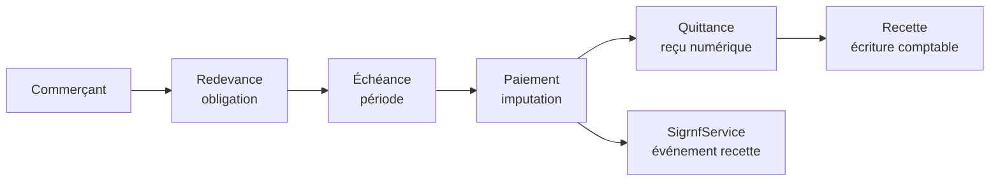
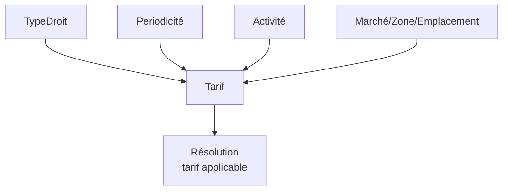
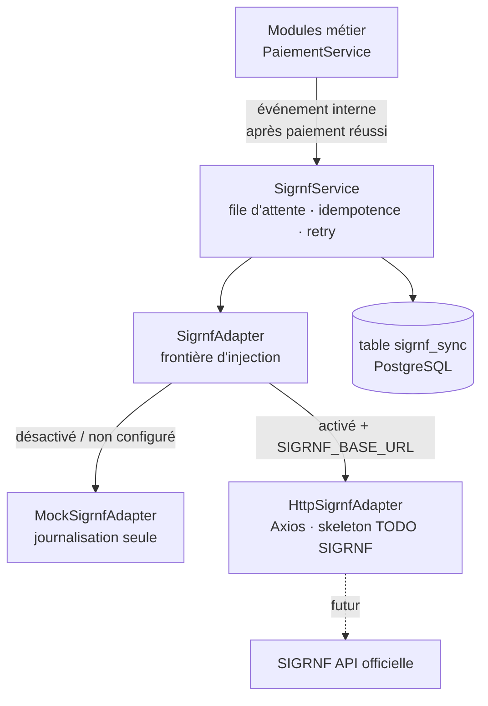
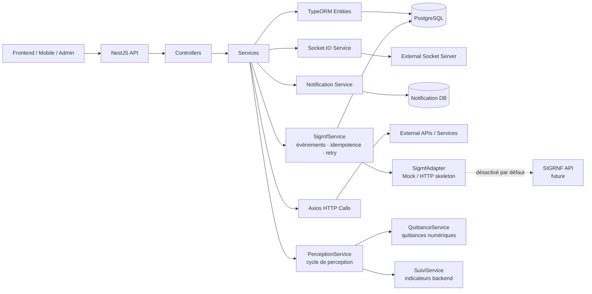

# ModernMarket Backend - Architecture technique

## 1. Description du projet

Ce projet est un backend NestJS destiné à la gestion d’un système de locations commerciales et de gestion territoriale de marché. Il permet de gérer :

- les zones géographiques et leur délimitation,
- les locaux disponibles / loués / indisponibles,
- les types de locaux avec leurs caractéristiques (taille, tarif, type de contrat),
- les locations et leurs périodes de location,
- les paiements associés aux locations,
- les notifications aux utilisateurs (paiement, confirmation de location, rappel, etc.),
- la distribution de zones aux utilisateurs,
- la communication temps réel avec des services WebSocket,
- la préparation d'une intégration future avec SIGRNF (couche isolée et désactivable, sans impact sur les flux métier existants).

Le projet est centré sur une logique métier de gestion immobilière / commerciale, probablement pour un marché urbain ou des espaces de commerce dans plusieurs zones administratives.

---

## 2. Stack technique

### Framework et langage
- TypeScript
- NestJS 11
- Node.js

### Base de données
- PostgreSQL
- PostGIS / support de type geometry pour les zones
- TypeORM

### Services transverses
- Swagger pour la documentation API
- Joi pour validation des variables d’environnement
- @nestjs/config pour configuration centralisée
- @nestjs/schedule pour tâches planifiées
- Socket.IO client pour notifications / intégration temps réel
- Axios pour appels HTTP

### Architecture générale
Le backend suit les principes de NestJS :
- modules par domaine métier,
- contrôleurs pour exposer les endpoints REST,
- services pour la logique métier,
- entités TypeORM pour la persistance,
- repositories injectés dans les services.

---

## 3. Architecture technique

### 3.1. Structure du projet

```text
src/
├── app.module.ts                 # point d'entrée des modules NestJS
├── main.ts                       # bootstrap NestJS + CORS + Swagger
├── data-source.ts                # DataSource TypeORM pour CLI migrations
├── Database/
│   └── database.module.ts        # configuration TypeORM PostgreSQL (synchronize: false)
├── migrations/                   # migrations TypeORM versionnées
│   ├── 1791400984828-InitialSchema.ts
│   ├── 1791402444549-ConfigurationDroits.ts
│   ├── 1791403544628-PresenceControleTerrain.ts
│   ├── 1791404176607-PaiementCyclePerception.ts
│   └── 1791404936354-AuditOperation.ts
├── zone/                         # gestion des zones géographiques
├── local/                        # gestion des locaux
├── location/                     # gestion des locations
├── type_local/                   # types de locaux
├── paiement/                     # gestion des paiements (legacy + cycle perception)
├── paiement_location/            # relation entre paiement et location
├── distribution_zone/            # attribution d'une zone à un utilisateur
├── notification/                 # notifications utilisateur
├── socket/                      # intégration Socket.IO
├── sigrnf/                      # couche d'intégration SIGRNF (isolée, désactivable)
│   ├── sigrnf.module.ts         # module isolé, sans dépendance vers le domaine
│   ├── sigrnf.service.ts        # événements, file d'attente, idempotence, retry
│   ├── sigrnf.controller.ts     # GET /sigrnf/status (diagnostic)
│   ├── sigrnf.config.ts         # chargement de la configuration SIGRNF
│   ├── sigrnf-payload.mapper.ts # mapping explicite RevenueEvent → payload
│   ├── dto/                     # modèle interne validable (≠ modèle SIGRNF)
│   ├── interfaces/              # RevenueEvent interne + frontière SigrnfAdapter
│   ├── adapters/                # MockSigrnfAdapter + HttpSigrnfAdapter (skeleton)
│   └── entities/                # sigrnf_sync (table d'intégration locale)
├── modele_cible/                # modèle métier cible (entités de référence)
│   └── entities/                # 19 entités (commune, marche, commercant, tarif, etc.)
├── commercant/                  # module gestion des commerçants (12 endpoints)
├── droits/                       # module configuration droits/tickets/périodicités/tarifs
├── terrain/                      # module présence et contrôle terrain
├── perception/                   # module cycle de perception (paiements, échéances)
├── quittance/                   # module quittances numériques
└── suivi/                        # module suivi financier et opérationnel
```

### 3.2. Module racine
Le module principal `AppModule` importe les modules métiers suivants :

- `ZoneModule`
- `LocalModule`
- `LocationModule`
- `PaiementModule`
- `PaiementLocationModule`
- `NotificationModule`
- `TypeLocalModule`
- `DistributionZoneModule`
- `SocketModule`
- `SigrnfModule` (intégration SIGRNF, désactivée par défaut)
- `CommercantModule` (gestion des commerçants)
- `DroitsModule` (configuration droits/tickets/périodicités/tarifs)
- `TerrainModule` (présences et contrôles terrain)
- `PerceptionModule` (cycle de perception : paiements, échéances, quittances)
- `QuittanceModule` (quittances numériques)
- `SuiviModule` (indicateurs financiers et opérationnels)
- `ScheduleModule.forRoot()`

La configuration globale charge les variables d’environnement nécessaires à la connexion PostgreSQL :
- `POSTGRES_HOST`
- `POSTGRES_PORT`
- `POSTGRES_USER`
- `POSTGRES_PASSWORD`
- `POSTGRES_DATABASE`
- `PORT`

ainsi que les variables de l’intégration SIGRNF (validées par Joi, aucune valeur secrète dans le dépôt) :
- `SIGRNF_ENABLED` (défaut `false`)
- `SIGRNF_BASE_URL` (défaut vide)
- `SIGRNF_API_KEY` (défaut vide, jamais journalisée)
- `SIGRNF_TIMEOUT_MS` (défaut `10000`)
- `SIGRNF_RETRY_ATTEMPTS` (défaut `3`)

### 3.3. Couche d’accès aux données
La base de données est configurée dans `DatabaseModule` avec TypeORM.

Caractéristiques importantes :
- type `postgres`
- `entities: [__dirname + '/../**/*.entity.{js,ts}']`
- `synchronize: false` : le schéma n'est plus synchronisé automatiquement
- `migrations: [__dirname + '/../migrations/*.{js,ts}']` : migrations versionnées
- `migrationsRun: false` : les migrations sont exécutées manuellement via `npm run migration:run`
- `logging: ['error']`

Les migrations sont gérées via la CLI TypeORM (`src/data-source.ts`) :
- `npm run migration:generate` — génère une migration depuis les entités
- `npm run migration:run` — applique les migrations en attente
- `npm run migration:revert` — annule la dernière migration
- `npm run migration:show` — liste les migrations appliquées/en attente

Cela montre une configuration orientée production avec gestion versionnée du schéma.

### 3.4. Couche API
Le fichier `main.ts` configure :
- l’application NestJS,
- la préfixe global `servicemodernmarket`,
- le CORS ouvert,
- le Swagger accessible à `/servicemodernmarket/docs`.

Cela indique une API exposée pour un front-end ou un autre service qui consomme les ressources.

### 3.5. Couche métier
Les services sont découpés par domaine métier :

- `ZoneService` : gestion des zones et de leurs contours géométriques.
- `LocalService` : gestion des locaux, disponibilité et association zone / type local.
- `LocationService` : gestion des contrats de location, dates, fréquence, utilisateur, local associé.
- `PaiementService` : gestion des paiements et références de transaction (legacy).
- `NotificationService` : création de notifications d'état, rappel, paiement, location.
- `SocketService` : envoi ou réception de messages temps réel via Socket.IO.
- `CommercantService` : gestion des commerçants (CRUD, recherche, filtres, fiche complète).
- `DroitsService` : configuration des droits/tickets, périodicités, tarifs, activités.
- `TerrainService` : enregistrement des présences et contrôles terrain (GPS, anomalies).
- `PerceptionService` : cycle de perception (paiements → quittances → recettes, situation centralisée).
- `QuittanceService` : quittances numériques (génération PDF, vérification d'authenticité, audit).
- `SuiviService` : indicateurs financiers et opérationnels (agrégations backend).
- `SigrnfService` : intégration SIGRNF (événements, file d'attente, idempotence, retry).

### 3.6. Intégration événementielle / temps réel
Le projet intègre un service `SocketService` qui se connecte à un serveur externe via Socket.IO. Ce composant est utilisé pour :

- notifier des événements de paiement,
- transmettre des données à un service tiers,
- écouter des événements comme `notifRecetteLocaleReceived`.

Cette couche est essentielle pour l’interopérabilité avec d’autres services du système Modern Market.

### 3.7. Comportement fonctionnel principal
Le modèle de domaine révèle les flux métiers suivants :

1. Une `Zone` contient plusieurs `Local`.
2. Un `Local` a un `Typelocal` et appartient à une `Zone`.
3. Une `Location` est liée à un `Local` et a un utilisateur (`id_user`).
4. Un `Paiement` est lié à plusieurs `PaiementLocation`.
5. Une `PaiementLocation` relie un `Paiement` à une `Location` et enregistre le montant payé.
6. Une `Notification` est créée selon le statut d'une location ou d'un paiement.
7. Une `DistributionZone` relie un utilisateur à une zone et permet son attribution.

### 3.7a. Cycle de perception (nouveau)



- Une `Redevance` est une obligation financière rattachée à un commerçant.
- Une `Échéance` planifie une période de paiement avec un montant théorique.
- Un `Paiement` (via `PerceptionService`) impute un montant sur une redevance.
- Une `Quittance` est générée automatiquement avec jeton d'authenticité HMAC.
- Une `Recette` est créée pour chaque paiement validé.
- Le calcul de situation (`situation.calculator.ts`) est centralisé côté backend.

### 3.7b. Configuration des droits et tarifs



- Les tarifs sont configurables par marché, zone, emplacement, type d'activité, type de droit, périodicité, convention.
- La résolution (`GET /tarifs/resoudre`) ne retourne que les tarifs actifs et dans leur période de validité.
- Les périodicités sont extensibles par lignes (aucun enum figé).

### 3.8. Intégration SIGRNF (préparation)

Le backend est **SIGRNF-ready** mais pas **SIGRNF-dependent** : une couche
d’intégration isolée a été ajoutée en prévision d’un futur contrat API SIGRNF,
sans en inventer aucun élément (endpoints, payloads, authentification, codes de
recette restent à fournir — voir les `TODO(SIGRNF)`).

#### Principe d’architecture



Aucun module métier ne contacte SIGRNF directement : `PaiementService` émet
uniquement un `RevenueEvent` interne vers `SigrnfService`.

#### Garanties

- **Désactivable** : `SIGRNF_ENABLED=false` par défaut ; aucun appel réseau
  externe n’est effectué et la tâche de retry reste inerte.
- **Résilient** : le point d’émission est exécuté *après* le `commit` de la
  transaction de paiement, dans un `try/catch` isolé ; `SigrnfService` ne lève
  jamais d’exception — une panne SIGRNF ne bloque jamais un paiement local.
- **Idempotent** : contrainte unique `UQ_sigrnf_sync_event_reference`
  sur `(eventType, localReference)` ; une référence de paiement déjà
  `SUCCESS` n’est jamais réémise. Aucune référence SIGRNF n’est inventée.
- **Fiable** : table `sigrnf_sync` avec statuts
  `PENDING → PROCESSING → SUCCESS | FAILED` et tâche `@Cron` (toutes les
  5 minutes, via `@nestjs/schedule` déjà présent) qui reprend les
  `PENDING` / `FAILED`.
- **Sobre** : logs formatés `[SIGRNF] …` (jamais de clé, jeton, mot de passe
  ni donnée personnelle détaillée).

#### Endpoint de diagnostic

```http
GET /servicemodernmarket/sigrnf/status
→ { "enabled": false, "configured": false }
```

N’expose ni secret ni payload.

#### État d’avancement

| Élément | Statut |
| --- | --- |
| Configuration + validation Joi | ✅ |
| Module / service / adaptateurs | ✅ |
| Émission après paiement réussi | ✅ |
| Table `sigrnf_sync` + idempotence | ✅ |
| Retry périodique (`@nestjs/schedule`) | ✅ |
| Tests de la couche (10 tests) | ✅ |
| Appel HTTP réel | ⛔ bloqué sur le contrat officiel (`TODO(SIGRNF)`) |

Documentation détaillée : `docs/sigrnf_integration.md`.

---

## 4. Modèle de données métier

### Entités principales (existantes)

- `Zone`
  - `id_zone`
  - `nom`
  - `status`
  - `formatted_id`
  - `municipalityId`
  - `marcheId` (FK → Marche, nullable)
  - `delimitation` (géométrie polygonale)

- `Typelocal`
  - `id_type_local`
  - `municipalityId`
  - `typeLoc` (JSON)
  - `type_contrat`
  - `longueur`, `largeur`, `tarif`

- `Local`
  - `id_local`
  - `numero`
  - `statut`
  - `zoneId`, `typelocalId`
  - `latitude`, `longitude`, `rotation`
  - `date_derniere_scan`

- `Location`
  - `id_location`
  - `periodicite`
  - `id_user`
  - `nif`
  - `commercantId` (FK → Commercant, nullable)
  - `date_debut_loc`, `date_fin_loc`
  - `frequence`, `usage`
  - `localId`

- `Paiement`
  - `id_paiement`
  - `reference` (unique)
  - `status` (enum: success/failed)
  - `raison`
  - `montant`
  - `modePaiementId` (FK → ModePaiement, nullable)
  - `canal` (BUREAU/TERRAIN)
  - `agentId` (FK → Agent, nullable)
  - `commercantId` (FK → Commercant, nullable)
  - `redevanceId` (FK → Redevance, nullable)
  - `source` (TERRAIN/BUREAU/API_EXTERNE/IMPORT_HISTORIQUE)
  - `date_creation`

- `Paiementlocation`
  - `id_paiement_location`
  - `locationId`
  - `nombre_paye`
  - `montant_paye`
  - `date_debut`, `date_fin`, `date_paiement`

- `Notification`
  - `id_notification`
  - `userId`
  - `type`
  - `title`, `message`
  - `data` (JSON)
  - `isRead`, `priority`, `channels`
  - `scheduledAt`, `sentAt`, `readAt`

- `DistributionZone`
  - `id_distribution_zone`
  - `id_user`
  - `zoneId`
  - `status`
  - `createdAt`, `updatedAt`

### Entités du modèle cible (`modele_cible/entities/`)

- `Commune` — `id`, `codeExt` (unique), `nom`, `actif`
- `Marche` — `id`, `communeId` (FK), `nom`, `actif` ; UQ `(communeId, nom)`
- `ActiviteCommerciale` — `id`, `code` (unique), `libelle` (jsonb bilingue), `actif`
- `Commercant` — `id`, `userId` (unique, nullable), `nif` (nullable, jamais unique), `activiteId` (FK), `actif`
- `Periodicite` — `id`, `code` (unique), `libelle`, `unite` (JOUR/SEMAINE/MOIS/ANNEE), `nbUnites` (>0), `actif`
- `ModePaiement` — `id`, `code` (unique), `libelle`, `actif`
- `TypeDroit` — `id`, `code` (unique), `libelle` (jsonb), `periodiciteId` (FK), `portee` (EMPLACEMENT/ZONE/MARCHE), `famille` (DROIT/TICKET), `peutPayerPartiel` (tri-state nullable), `reglesRenouvellement` (jsonb), `actif`
- `Tarif` — `id`, `typeDroitId` (FK), `periodiciteId` (FK), `typelocalId`, `zoneId`, `marcheId`, `localId`, `activiteId`, `convention`, `montant` (≥0), `devise`, `dateDebut`, `dateFin`, `actif` ; CHECK portée minimale
- `Echeance` — `id`, `locationId` (FK), `commercantId` (FK), `typeDroitId` (FK), `periodeDebut`, `periodeFin`, `dateEcheance`, `montantTheorique` (≥0), `statut`, `source` ; UQ `(locationId, typeDroitId, periodeDebut, periodeFin)`
- `Redevance` — `id`, `echeanceId` (FK, unique), `locationId` (FK), `commercantId` (FK), `montantDu` (≥0), `montantRegle` (≥0, ≤montantDu), `statut`, `dateOuverture`, `dateCloture`, `motif`
- `PaiementRedevance` — `id`, `paiementId` (FK), `redevanceId` (FK), `montantImpute` (>0) ; UQ `(paiementId, redevanceId)`
- `Quittance` — `id`, `numero` (unique), `paiementId` (FK, unique), `montant` (≥0), `dateEmission`, `statut` (EMISE/ANNULEE/REMPLACEE), `agentId` (FK), `documentUrl`, `qrToken`
- `Recette` — `id`, `paiementId` (FK, unique), `dateRecette`, `montant` (≥0), `modePaiementId` (FK), `canal`
- `Agent` — `id`, `matricule` (unique), `userId` (unique, nullable), `nomComplet`, `role`, `actif`
- `Presence` — `id`, `commercantId` (FK), `datePresence`, `zoneId` (FK), `localId` (FK), `source` (GPS/MANUEL/SCAN), `latitude`, `longitude`, `precisionGps`, `horodatage`
- `Controle` — `id`, `agentId` (FK), `dateControle`, `zoneId` (FK), `localId` (FK), `commercantId` (FK), `presenceId` (FK), `typeAnomalie`, `observations`, `statut` (OUVERT/CLOTURE), `resultat` (CONFORME/ANOMALIE/HORS_ZONE/GPS_INDISPONIBLE/FAIBLE_PRECISION/SANS_EMPLACEMENT_FIXE/CONTROLE_MANUEL), `comparerPosition`, `latitude`, `longitude`, `precisionGps`
- `Affectation` — `id`, `commercantId` (FK), `localId` (FK), `dateDebut`, `dateFin`, `statut` (ACTIVE/TERMINEE/RESILIEE), `motif`, `montantTheoriqueMensuel` ; UQ `(commercantId, localId, dateDebut)`
- `Parametre` — `id`, `cle`, `portee`, `scopeId`, `valeur` (jsonb), `description`, `actif` ; UQ `(cle, portee, scopeId)`
- `AuditLog` — `id`, `tableName`, `recordId`, `action` (CREATION/MODIFICATION/SUPPRESSION), `operation` (nullable), `acteurId`, `ancienEtat` (jsonb), `nouvelEtat` (jsonb), `ip`, `createdAt`

### Table d'intégration (non métier)

- `SigrnfSync` — table locale `sigrnf_sync`, créée via migration TypeORM, sans relation métier :
  - `id` (uuid, PK)
  - `eventType` (type d’événement interne, ex. `REVENUE_PAYMENT`)
  - `localReference` (référence locale du paiement — clé d’idempotence)
  - `status` (`PENDING` | `PROCESSING` | `SUCCESS` | `FAILED`)
  - `attemptCount`, `lastAttemptAt`, `sentAt`
  - `responseReference` (réservé au contrat SIGRNF futur)
  - `errorMessage`
  - `payload` (jsonb : `RevenueEvent` interne, ≠ payload SIGRNF)
  - `createdAt`, `updatedAt`
  - unique : `(eventType, localReference)` → `UQ_sigrnf_sync_event_reference`

---

## 5. Diagramme de Classe UML

```mermaid
classDiagram
    class Zone {
        +uuid id_zone
        +string nom
        +boolean status
        +string formatted_id
        +string municipalityId
        +uuid marcheId
        +geometry delimitation
        +Local[] locaux
        +DistributionZone[] distributionZones
    }

    class Typelocal {
        +uuid id_type_local
        +string municipalityId
        +json typeLoc
        +enum type_contrat
        +number longueur
        +number largeur
        +json description
        +number tarif
        +Local[] locaux
    }

    class Local {
        +uuid id_local
        +string numero
        +enum statut
        +uuid zoneId
        +uuid typelocalId
        +decimal latitude
        +decimal longitude
        +decimal rotation
        +date date_derniere_scan
        +Zone zone
        +Typelocal typelocal
        +Location[] locations
    }

    class Location {
        +uuid id_location
        +enum periodicite
        +uuid id_user
        +string nif
        +uuid commercantId
        +date date_debut_loc
        +date date_fin_loc
        +number frequence
        +string usage
        +uuid localId
        +Local local
        +Commercant commercant
        +Paiementlocation[] paiement_locations
    }

    class Paiement {
        +uuid id_paiement
        +string reference
        +enum status
        +string raison
        +decimal montant
        +uuid modePaiementId
        +string canal
        +uuid agentId
        +uuid commercantId
        +uuid redevanceId
        +string source
        +date date_creation
        +Paiementlocation[] paiement_locations
    }

    class Paiementlocation {
        +uuid id_paiement_location
        +uuid locationId
        +number nombre_paye
        +number montant_paye
        +date date_debut
        +date date_fin
        +date date_paiement
        +Location location
        +Paiement paiement
    }

    class DistributionZone {
        +uuid id_distribution_zone
        +uuid id_user
        +uuid zoneId
        +boolean status
        +timestamp createdAt
        +timestamp updatedAt
        +Zone zone
    }

    class Notification {
        +uuid id_notification
        +uuid userId
        +string type
        +string title
        +string message
        +json data
        +boolean isRead
        +enum priority
        +json channels
        +timestamp scheduledAt
        +timestamp sentAt
        +timestamp readAt
    }

    class SigrnfSync {
        +uuid id
        +string eventType
        +string localReference
        +enum status
        +int attemptCount
        +timestamp lastAttemptAt
        +timestamp sentAt
        +string responseReference
        +string errorMessage
        +json payload
        +timestamp createdAt
        +timestamp updatedAt
    }

    class Commercant {
        +uuid id
        +uuid userId
        +string nif
        +uuid activiteId
        +boolean actif
        +ActiviteCommerciale activite
    }

    class Redevance {
        +uuid id
        +uuid echeanceId
        +uuid locationId
        +uuid commercantId
        +decimal montantDu
        +decimal montantRegle
        +string statut
        +date dateOuverture
        +date dateCloture
        +string motif
    }

    class Echeance {
        +uuid id
        +uuid locationId
        +uuid commercantId
        +uuid typeDroitId
        +date periodeDebut
        +date periodeFin
        +date dateEcheance
        +decimal montantTheorique
        +string statut
        +string source
    }

    class Tarif {
        +uuid id
        +uuid typeDroitId
        +uuid periodiciteId
        +uuid typelocalId
        +uuid zoneId
        +uuid marcheId
        +uuid localId
        +uuid activiteId
        +string convention
        +decimal montant
        +string devise
        +date dateDebut
        +date dateFin
        +boolean actif
    }

    class Quittance {
        +uuid id
        +string numero
        +uuid paiementId
        +decimal montant
        +date dateEmission
        +string statut
        +uuid agentId
        +string documentUrl
        +string qrToken
    }

    class Recette {
        +uuid id
        +uuid paiementId
        +date dateRecette
        +decimal montant
        +uuid modePaiementId
        +string canal
    }

    class Presence {
        +uuid id
        +uuid commercantId
        +date datePresence
        +uuid zoneId
        +uuid localId
        +string source
        +decimal latitude
        +decimal longitude
        +decimal precisionGps
        +timestamp horodatage
    }

    class Controle {
        +uuid id
        +uuid agentId
        +date dateControle
        +uuid zoneId
        +uuid localId
        +uuid commercantId
        +uuid presenceId
        +string typeAnomalie
        +string observations
        +string statut
        +string resultat
        +boolean comparerPosition
        +decimal latitude
        +decimal longitude
        +decimal precisionGps
    }

    class AuditLog {
        +uuid id
        +string tableName
        +uuid recordId
        +string action
        +string operation
        +uuid acteurId
        +json ancienEtat
        +json nouvelEtat
        +string ip
        +timestamp createdAt
    }

    Zone "1" --> "0..*" Local
    Zone "1" --> "0..*" DistributionZone
    Typelocal "1" --> "0..*" Local
    Local "1" --> "0..*" Location
    Location "1" --> "0..*" Paiementlocation
    Paiement "1" --> "0..*" Paiementlocation
    Commercant "1" --> "0..*" Location
    Commercant "1" --> "0..*" Redevance
    Redevance "1" --> "0..*" PaiementRedevance
    Paiement "1" --> "0..*" PaiementRedevance
    Paiement "1" --> "1" Quittance
    Paiement "1" --> "1" Recette
    Echeance "1" --> "0..*" Redevance
    TypeDroit "1" --> "0..*" Tarif
    note for SigrnfSync "Table d'intégration SIGRNF (non métier) :<br/>aucune relation avec les entités métier ;<br/>unique (eventType, localReference)"
```



---

## 6. Vue d'architecture fonctionnelle



---

## 7. Analyse fonctionnelle du projet

Le backend s'inscrit dans un système plus large de gestion immobilière et commerciale. Il centralise les opérations liées à :

- l'inventaire des lieux de commerce,
- la géographie des zones et de leur découpage territorial,
- la gestion des contrats de location,
- le suivi des paiements,
- la communication avec les utilisateurs et les services tiers.

Les points forts du projet sont :

- modularisation claire par domaine métier,
- utilisation de PostgreSQL pour les données relationnelles,
- intégration de géométrie et de localisation,
- support des notifications internes et temps réel,
- présence de Swagger pour documenter l'API,
- couche d'intégration SIGRNF préparée : isolée, désactivable, résiliente et
  sans dépendance ajoutée (Axios, TypeORM, `@nestjs/schedule` et Swagger déjà
  utilisés par le projet),
- **cycle de perception complet** : commerçant → redevance → échéance → paiement → quittance → recette,
- **calcul centralisé de la situation financière** (backend = source de vérité),
- **moteur de configuration** des droits/tickets, périodicités et tarifs,
- **suivi terrain** : présences et contrôles avec GPS configurable,
- **quittances numériques** avec vérification d'authenticité et piste d'audit,
- **indicateurs financiers et opérationnels** calculés côté backend,
- **migrations TypeORM versionnées** (synchronize: false).

Les points d'attention ou axes d'amélioration possibles :

- mettre en place des validations métier plus strictes,
- séparer explicitement les DTOs de l'exposition des entités,
- ~~ajouter des migrations de base de données plutôt que `synchronize: true`~~ ✅ fait,
- sécuriser davantage les flux WebSocket et les variables d'environnement,
- standardiser les conventions de nommage et les types de données,
- ~~ajouter des tests unitaires et d'intégration sur les services métier et les contrôleurs~~ ✅ fait,
- compléter `HttpSigrnfAdapter` (endpoint, authentification, format du payload)
  dès réception du contrat officiel SIGRNF, via les `TODO(SIGRNF)` existants —
  sans modifier le domaine métier.

---

## 8. Conclusion

Ce backend est un service NestJS orienté gestion de marchés / locaux commerciaux, avec une architecture modulaire basée sur des entités relationnelles et des services métiers cohérents. Il combine gestion de données spatiales, monitoring des locations, paiements et notifications, en plus de l'intégration WebSocket pour faire vivre des événements en temps réel.

Le backend est également **SIGRNF-ready** : la couche `sigrnf/` permet de brancher la future API officielle SIGRNF (recettes issues des paiements) en ne remplaçant que l'adaptateur HTTP, les paiements locaux restant totalement indépendants de sa disponibilité.

### Évolutions récentes (P0–P2)

| Module | Rôle |
|---|---|
| `modele_cible` | 19 entités de référence (commune, marche, commercant, tarif, etc.) |
| `commercant` | Gestion des commerçants (12 endpoints, fiche complète) |
| `droits` | Configuration droits/tickets, périodicités, tarifs, activités |
| `terrain` | Présences et contrôles terrain (GPS, anomalies, audit) |
| `perception` | Cycle de perception (paiements → quittances → recettes) |
| `quittance` | Quittances numériques (PDF, authenticité HMAC, audit) |
| `suivi` | Indicateurs financiers et opérationnels (agrégations backend) |

### Migrations TypeORM

| Migration | Description |
|---|---|
| `1791400984828-InitialSchema` | Schéma initial (29 tables) |
| `1791402444549-ConfigurationDroits` | Colonnes famille/reglesRenouvellement/actif |
| `1791403544628-PresenceControleTerrain` | Champs GPS, résultat, audit |
| `1791404176607-PaiementCyclePerception` | Lien paiement → commerçant/redevance |
| `1791404936354-AuditOperation` | Colonne operation dans audit_log |

Le design est cohérent avec un système métier de type SaaS de gestion d'espaces commerciaux et de zones de distribution.
